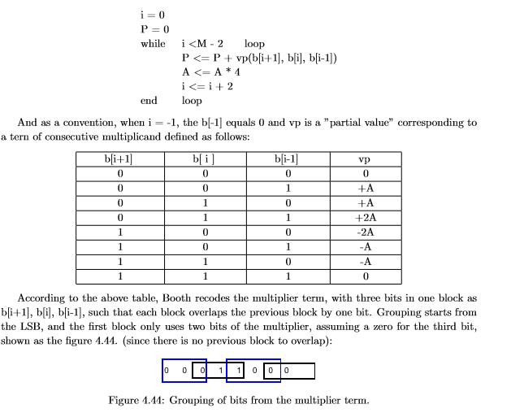
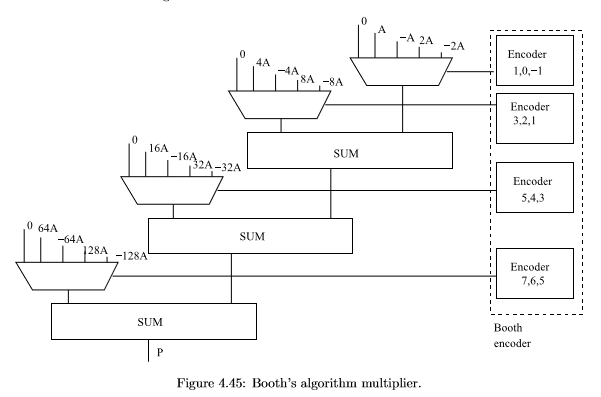

The booth multiplier is a generic N bit fast multiplier. It works only with signed numbers. 
It is based on the booth algorithm reported below.

Starting from the algorithm there is the hardware implementation:

The adders are implemented trought fast adder (Pentium IV adder).
Top level entity is Booth_Multiplier.vhdl